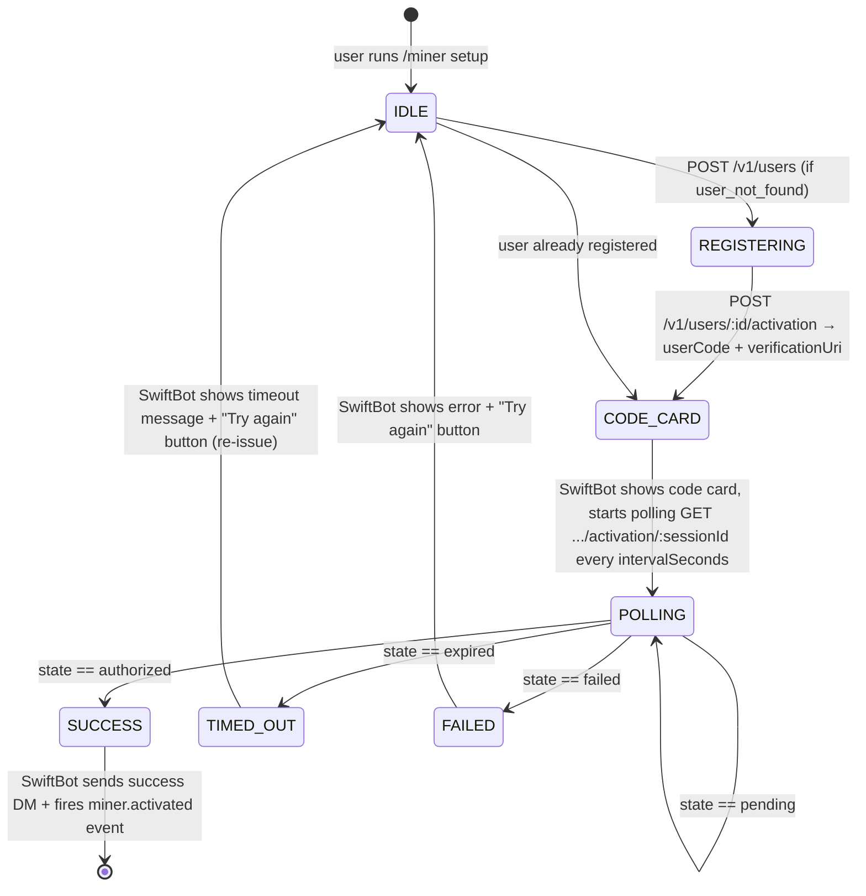
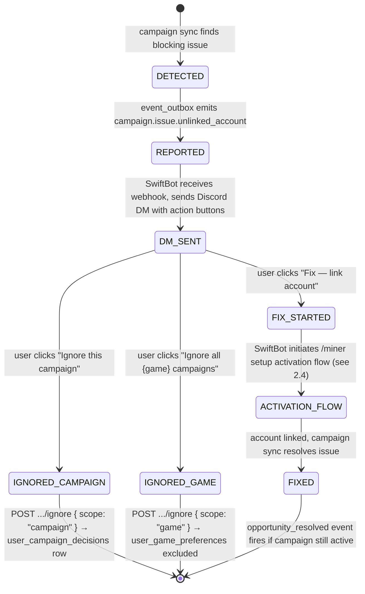

# SwiftMiner ↔ SwiftBot Integration Design

**Version:** 1.0-locked  
**Owner:** @kimi (synthesis), with contributions from Backend/API, @codex (events/webhooks), @gemini (Discord UX)  
**Status:** Phase 3b — COMPLETE. Design locked pending @John approval.  

---

## 1. System Architecture (Text Diagram)

```
┌─────────────────────────────────────────────────────────────────────────────┐
│                              DISCORD PLATFORM                                │
│  ┌──────────────┐    DMs / slash commands    ┌──────────────────────────┐  │
│  │   Discord    │ ◄────────────────────────► │        SwiftBot          │  │
│  │   User       │                            │  (Discord bot interface) │  │
│  └──────────────┘                            └────────────┬─────────────┘  │
└───────────────────────────────────────────────────────────┼─────────────────┘
                                                            │ HTTPS + Webhook
                                                            │ (localhost/VPN)
┌───────────────────────────────────────────────────────────┼─────────────────┐
│                      SWIFTMINER (macOS host)                              │
│                                                                           │
│  ┌─────────────────────────────────────────────────────────────────────┐  │
│  │                     SwiftMiner HTTP API Server                       │  │
│  │  ┌─────────────┐  ┌─────────────┐  ┌─────────────┐  ┌───────────┐ │  │
│  │  │  /users     │  │ /campaigns  │  │ /miners     │  │ /actions  │ │  │
│  │  │  (CRUD)     │  │ (eligibility│  │ (state)     │  │ (link,    │ │  │
│  │  │             │  │  + issues)  │  │             │  │  ignore,  │ │  │
│  │  │             │  │             │  │             │  │  priority)│ │  │
│  │  └─────────────┘  └─────────────┘  └─────────────┘  └───────────┘ │  │
│  └─────────────────────────────────────────────────────────────────────┘  │
│                              │                                            │
│                              ▼                                            │
│  ┌─────────────────────────────────────────────────────────────────────┐  │
│  │                    SwiftMiner Service Layer                          │  │
│  │  ┌──────────────┐  ┌──────────────┐  ┌──────────────┐              │  │
│  │  │ AdminLinking │  │  MinerManager│  │  EventOutbox │              │  │
│  │  │   Service    │  │  (@MainActor)│  │   Service    │              │  │
│  │  └──────────────┘  └──────────────┘  └──────────────┘              │  │
│  └─────────────────────────────────────────────────────────────────────┘  │
│                              │                                            │
│                              ▼                                            │
│  ┌─────────────────────────────────────────────────────────────────────┐  │
│  │              SwiftMinerCore Engine + Persistence                     │  │
│  │  ┌─────────────┐ ┌─────────────┐ ┌─────────────┐ ┌──────────────┐  │  │
│  │  │ MinerEngine │ │ TwitchAuth  │ │  Campaign   │ │   SQLite     │  │  │
│  │  │   (actor)   │ │  Service    │ │   Service   │ │   (9 tables) │  │  │
│  │  └─────────────┘ └─────────────┘ └─────────────┘ └──────────────┘  │  │
│  └─────────────────────────────────────────────────────────────────────┘  │
│                                                                           │
│  ┌─────────────────────────────────────────────────────────────────────┐  │
│  │                        Data Model (SQLite)                           │  │
│  │  miner_users ──► twitch_accounts ──► reward_ledger                  │  │
│  │       │                │                                            │  │
│  │       ▼                ▼                                            │  │
│  │  user_game_preferences  oauth_link_sessions                         │  │
│  │  user_issues           event_outbox  ◄── webhook poller reads      │  │
│  │  opportunity_blocked_events  admin_audit_log                        │  │
│  │  progress_event_state                                               │  │
│  └─────────────────────────────────────────────────────────────────────┘  │
└───────────────────────────────────────────────────────────────────────────┘
```

**Design principles:**
1. **SwiftMiner is the single source of truth** for all mining state, identity mapping, and persistence.
2. **SwiftBot is a thin Discord client** — it renders state from SwiftMiner APIs and reacts to SwiftMiner events. It owns no mining logic.
3. **All state mutations go through SwiftMiner APIs** — SwiftBot never writes to the SwiftMiner DB directly.
4. **Events are authoritative but best-effort** — SwiftBot should poll APIs as ground truth, using events as latency optimization.

---

## 2. Output Skeleton — Phase 2 Draft Sections

> All agents draft into the sections below. Do not add new top-level sections without @kimi review.

### 2.1 API Contract — Backend/API
> Endpoint list, request/response schemas, auth model. Status: ✅ Drafted

**Auth model:** All Bot-tier endpoints require `Authorization: Bot {key}`. Base path: `/api/v1`.  
**Error envelope:** `{ "error": "snake_case_code", "message": "Human-readable string", "detail": {} }`

---

> ⚠️ **SUPERSEDED by `GET /v1/discord/users/:discordUserId`** (see section 2.7). Retained for reference only.

#### ~~GET /v1/users/:discordId/state~~ *(superseded)*
**Auth:** Bot  
**Response 200:**
```json
{
  "discordUserId": "123456789012345678",
  "minerState": "linked | active | idle | blocked",
  "accounts": [
    { "twitchAccountId": "12345", "username": "someuser", "linkState": "linked | pending | unlinked", "isActive": true }
  ],
  "activeIssueCount": 1,
  "lastSeenAt": "2026-04-24T09:00:00Z"
}
```
**4xx:** `user_not_found` (404)

---

#### POST /v1/users
**Auth:** Bot  
**Request:** `{ "discordUserId": "123456789012345678" }`  
**Response 200:** `{ "userId": "uuid", "discordUserId": "...", "status": "registered" }`  
**4xx:** `invalid_discord_id` (400), `user_already_exists` (409)

---

#### GET /v1/users/by-discord/:discordUserId
**Auth:** Bot  
**Response 200:** Same shape as POST /v1/users response.  
**4xx:** `user_not_found` (404)

---

#### POST /v1/users/:discordId/activation
Initiates a Twitch device-code flow. SwiftMiner owns polling — SwiftBot only shows the user code and polls session state.  
**Auth:** Bot  
**Request:** `{}` (empty)  
**Response 200:**
```json
{
  "sessionId": "uuid",
  "userCode": "ABCD-1234",
  "verificationUri": "https://www.twitch.tv/activate",
  "expiresAt": "2026-04-24T09:15:00Z",
  "intervalSeconds": 5
}
```
**4xx:** `user_not_found` (404), `activation_already_pending` (409)

---

#### GET /v1/users/:discordId/activation/:sessionId
Poll-safe. SwiftBot calls every `intervalSeconds`.  
**Auth:** Bot  
**Response 200:**
```json
{
  "sessionId": "uuid",
  "state": "pending | authorized | expired | failed",
  "linkedAccountId": "twitchId or null",
  "twitchUsername": "string or null",
  "failureReason": "string or null"
}
```
**4xx:** `session_not_found` (404)

---

#### DELETE /v1/users/:discordId/activation/:sessionId
Cancel an in-progress activation session.  
**Auth:** Bot  
**Response:** 204 No Content

---

#### GET /v1/users/:discordId/campaigns
**Auth:** Bot  
**Response 200:**
```json
[
  {
    "campaignId": "abc123",
    "game": "Fortnite",
    "status": "eligible | blocked | ignored",
    "blockReason": "account_not_linked | null",
    "progress": { "current": 45, "required": 60, "unit": "minutes" },
    "endsAt": "2026-04-30T00:00:00Z"
  }
]
```
**4xx:** `user_not_found` (404)

---

#### GET /v1/users/:discordId/issues
**Auth:** Bot  
**Response 200:**
```json
[
  {
    "issueId": "uuid",
    "type": "account_not_linked",
    "campaignId": "abc123",
    "game": "Fortnite",
    "state": "open | ignored | resolved",
    "detectedAt": "2026-04-24T09:00:00Z"
  }
]
```

---

#### POST /v1/users/:discordId/campaigns/:campaignId/ignore
**Auth:** Bot  
**Request:** `{ "scope": "campaign | game", "reason": "optional string" }`  
**Response 200:** `{ "ignored": true, "scope": "campaign | game" }`  
Maps to `user_game_preferences state=excluded` (scope=game) or `user_campaign_decisions` (scope=campaign).

---

#### DELETE /v1/users/:discordId/campaigns/:campaignId/ignore
**Auth:** Bot  
**Response:** 204 No Content

---

#### POST /v1/users/:discordId/campaigns/:campaignId/prioritise
**Auth:** Bot  
**Request:** `{}`  
**Response 200:** `{ "prioritised": true }`

---

#### DELETE /v1/users/:discordId/campaigns/:campaignId/prioritise
**Auth:** Bot  
**Response:** 204 No Content

---

#### POST /v1/users/:discordId/link-sessions  *(existing — OAuth linking)*
#### GET /v1/oauth/twitch/callback  *(existing)*
#### POST /v1/users/:discordId/link-sessions/:linkId/complete  *(existing)*
> See v1.5.1 design. These bind an already-authenticated Twitch account to a Discord user. Separate from activation above.

### 2.2 Event Schema — @codex
> Projection-level user intent events. SwiftBot treats every event as a signal to re-fetch `GET /v1/discord/users/:discordUserId` before rendering. No miner/account/campaign internals leak through.

**Event envelope:**
```json
{
  "eventId": "evt_01H...",
  "eventType": "user.stateChanged",
  "occurredAt": "2026-04-24T10:14:00Z",
  "schemaVersion": 2,
  "producer": "swiftminer",
  "delivery": {
    "idempotencyKey": "user.stateChanged:discord:123",
    "attempt": 1
  },
  "subject": {
    "discordUserId": "123"
  },
  "data": { }
}
```

**Rules:**
- `eventId` is unique per emitted event and never reused.
- `delivery.idempotencyKey` is stable across retries of the same logical event.
- `subject.discordUserId` is the only subject identifier in projection-level events.
- No `twitchAccountId`, campaign block details, or raw miner status in projection-facing events.
- All fields use camelCase to match the API JSON dialect.
- SwiftBot always re-fetches the projection endpoint before rendering.

---

### `user.stateChanged`
**Trigger:** Projection `state` changes across `notConfigured | active | idle | blocked`.
**Idempotency key:** `user.stateChanged:discord:{discordUserId}:from:{previousState}:to:{currentState}:{occurredAt_epoch}`
**Delivery guarantee:** At-least-once
```json
{
  "eventType": "user.stateChanged",
  "subject": { "discordUserId": "123" },
  "data": {
    "previousState": "idle",
    "currentState": "active",
    "occurredAt": "2026-04-24T10:14:00Z"
  }
}
```

### `user.actionRequired`
**Trigger:** Projection enters or remains in a state with actionable `issues`.
**Idempotency key:** `user.actionRequired:discord:{discordUserId}:issue:{issueId}`
**Delivery guarantee:** At-least-once
```json
{
  "eventType": "user.actionRequired",
  "subject": { "discordUserId": "123" },
  "data": {
    "primaryIssueType": "account_not_linked",
    "occurredAt": "2026-04-24T10:14:00Z"
  }
}
```

### `user.dropClaimed`
**Trigger:** A user-visible reward claim succeeds.
**Idempotency key:** `user.dropClaimed:discord:{discordUserId}:drop:{dropId}`
**Delivery guarantee:** At-least-once
```json
{
  "eventType": "user.dropClaimed",
  "subject": { "discordUserId": "123" },
  "data": {
    "dropId": "drop_222",
    "occurredAt": "2026-04-24T10:14:00Z"
  }
}
```

### `user.opportunityAvailable`
**Trigger:** Projection gains a meaningful `upNext` opportunity worth surfacing proactively.
**Idempotency key:** `user.opportunityAvailable:discord:{discordUserId}:campaign:{campaignId}`
**Delivery guarantee:** At-least-once
```json
{
  "eventType": "user.opportunityAvailable",
  "subject": { "discordUserId": "123" },
  "data": {
    "occurredAt": "2026-04-24T10:14:00Z"
  }
}
```

---

> **Deprecated (internal-only):** `miner.activated`, `miner.idle`, `campaign.issue.unlinked_account`, `campaign.available`, `drop.claimed`, `opportunity.resolved` are now internal/source events. SwiftBot only sees the projection-level catalogue above.

### 2.3 Webhook Contract — @codex
> SwiftMiner POSTs to SwiftBot's registered webhook endpoint.

**Endpoint registration:**
SwiftBot registers its webhook URL with SwiftMiner via an admin configuration endpoint (future) or local settings. For Phase 1, the webhook URL is configured in SwiftMiner's settings alongside the existing SwiftBot endpoint.

**Delivery headers:**
```
POST /webhooks/swiftminer/events
X-SwiftMiner-Event-Id: evt_01H...
X-SwiftMiner-Event-Type: miner.activated
X-SwiftMiner-Delivery-Attempt: 1
X-SwiftMiner-Timestamp: 1713951480
X-SwiftMiner-Signature: v1=<hex_hmac_sha256>
```

**Signature base string:**
```
<timestamp>.<raw_request_body>
```
HMAC secret is shared between SwiftMiner and SwiftBot (configured in both apps).

**Receiver rules (SwiftBot):**
1. Reject if timestamp skew > 300s.
2. Reject if signature mismatch.
3. De-duplicate on `event_id` or stable `idempotency_key`.
4. Return `2xx` only after the event is durably recorded or safely no-op deduped.

**Retry and delivery lifecycle:**

Outbox states: `pending` → `delivering` → `sent` | `failed_retryable` → `failed_terminal`

Retry policy:
- Retry on network error or `5xx`.
- Do not retry on verified `2xx`.
- Treat `409` duplicate from SwiftBot as success.
- Treat most `4xx` as terminal except `408` / `429`.
- Backoff with jitter: `30s`, `2m`, `10m`, `1h`, `6h`, `24h`, then terminal.

**API/event division of responsibility:**
- Events notify that something changed.
- APIs answer current truth.
- SwiftBot should react to an event by fetching the latest relevant API state before rendering a rich message if freshness matters.**

### 2.4 Activation Lifecycle State Machine — Backend/API + @kimi
> Discord-side UX + backend persistence mapping. Status: ✅ Drafted

**State diagram:**


**Backend states → SwiftBot UX states:**

| Backend state | SwiftBot UX state | SwiftBot action |
|---|---|---|
| session created | `CODE_CARD` | Render ephemeral card: user code, verification URL, expiry countdown |
| `pending` | `POLLING` | Edit card silently each poll — no new messages |
| `authorized` | `SUCCESS` | Edit card to ✅ success; send DM "Your Twitch account @{username} is now active" |
| `expired` | `TIMED_OUT` | Edit card to ⏱ timeout; offer "Try again" button (calls re-issue) |
| `failed` | `FAILED` | Edit card to ❌ error; show `failureReason`; offer "Try again" button |

**Re-issue logic:** Any user in `TIMED_OUT` or `FAILED` can trigger a new activation by pressing "Try again" or re-running `/miner setup`. SwiftBot calls `POST /v1/users/:discordId/activation` again — SwiftMiner creates a new session. Old sessions are retained for audit. If a session is already `pending`, SwiftMiner returns `activation_already_pending` (409) — SwiftBot informs the user to complete the existing session or wait for expiry.

**Persistence rules per state:** See section 3.1.

### 2.5 Campaign Issue Lifecycle — Backend/API + @kimi
> Issue detection → notification → resolution. Status: ✅ Drafted

**State diagram:**


**Discord DM format for `campaign.issue.unlinked_account`:**
> ⚠️ **Campaign opportunity blocked**
> You're eligible for **{game}** drops but your Twitch account isn't linked.
> [Fix — link account]  [Ignore this campaign]  [Ignore all {game}]

**Ignore persistence:**

| Scope | Storage | Effect |
|---|---|---|
| `campaign` | `user_campaign_decisions` row (`scope=temporary`, `campaign_id` set) | Suppresses future events for this campaign instance only |
| `game` | `user_game_preferences` row (`state=excluded`, `game_id` set) | Suppresses all future events for this game across all campaigns |

**Fix flow from Discord:**
1. User clicks "Fix — link account" in DM
2. SwiftBot calls `POST /v1/users/:discordId/activation` → starts activation flow (section 2.4)
3. On `miner.activated` event: SwiftMiner campaign sync detects issue resolved
4. `opportunity_resolved` event fires → SwiftBot sends "✅ Issue resolved — mining resumed for {game}" DM

**`user_campaign_decisions` table schema:** See section 3.2.

**Persistence rules per state:** See section 3.2.

### 2.7 Discord User Projection — Backend/API
> Derived state for Discord. Not a direct reflection of internal miner state. Enforces 1 Discord = 1 Twitch.

**Endpoint:**

#### GET /v1/discord/users/:discordUserId
**Auth:** Bot  
**Response 200:**
```json
{
  "discordUserId": "123456789012345678",
  "state": "notConfigured | active | idle | blocked",
  "account": {
    "twitchAccountId": "12345",
    "username": "someuser"
  },
  "activeCampaign": {
    "campaignId": "abc",
    "game": "Fortnite",
    "progress": { "current": 45, "required": 60, "unit": "minutes", "pct": 75 },
    "endsAt": "2026-04-30T00:00:00Z"
  },
  "upNext": {
    "campaignId": "xyz",
    "game": "Valorant",
    "available": true,
    "blockReason": null
  },
  "issues": [
    {
      "issueId": "uuid",
      "type": "account_not_linked",
      "campaignId": "abc123",
      "game": "Apex Legends",
      "message": "Link your Twitch account to mine Apex Legends drops",
      "action": "link_account | ignore_campaign | ignore_game"
    }
  ]
}
```
**Note:** `campaignId` is included in issue objects so SwiftBot can construct `POST .../campaigns/:campaignId/ignore` action calls without additional lookups.  
**4xx:** `user_not_found` (404)

**Mapping rules (internal → projection):**

| Internal condition | Projection `state` |
|---|---|
| No `twitch_accounts` row with `owner_discord_id = discordUserId` | `notConfigured` |
| Account exists, engine currently mining a campaign | `active` |
| Account exists, no active campaign, no eligible campaigns | `idle` |
| Account exists, eligible campaign exists but open issue blocks it | `blocked` |

**Field semantics:**
- `account` — null if `notConfigured`. Otherwise the single Twitch account linked to this Discord user.
- `activeCampaign` — null if state ≠ `active`. The campaign the engine is currently watching for this account.
- `upNext` — null if nothing pending. Highest-priority eligible campaign not currently active. `blockReason` populated if the next campaign is blocked.
- `issues` — actionable issues only (max 3). Filtered from `user_issues` where `state = open` and a user action exists.

**1-to-1 enforcement:**
- Data model: `twitch_accounts.owner_discord_id` has a conceptual unique constraint per Discord user in the projection layer.
- API: `POST /v1/users/:discordId/activation` returns `409 account_already_linked` if the Discord user already has a linked Twitch account.
- Admin reassignment remains the only way to change which Twitch account belongs to a Discord user.

---

### 2.6 Identity Mapping — Backend/API + @codex
> SwiftMiner is the single source of truth for all identity mapping.

```
Primary key: discord_id (TEXT) in miner_users
Linkage:     twitch_accounts.owner_discord_id -> miner_users.discord_id
Activation:  oauth_link_sessions.discord_id -> miner_users.discord_id
```

**Cardinality:** One Discord user → N Twitch accounts (`twitch_accounts` rows).

**API identity format:**
- Path parameter: `:discordId` in all user-scoped endpoints.
- Auth header: `Authorization: Bot {key}` — the bot key identifies SwiftBot, not the user. User identity comes from the path.

**Event identity format:**
- `subject.discord_user_id` is the bot-facing primary subject.
- `subject.twitch_account_id` included when known.
- If an event is account-scoped before user linkage exists, SwiftMiner should not DM through SwiftBot yet; instead persist the issue and emit a user-addressable event only once a Discord subject exists.

**Activation identity chain:**
1. `/miner setup` → SwiftBot calls `POST /v1/users` → `miner_users` row created with `discord_id`
2. SwiftBot calls `POST /v1/users/:discordId/activation` → `oauth_link_sessions` row created
3. User authorises on Twitch → SwiftMiner polls device code, creates `twitch_accounts` row, sets `owner_discord_id = discordId`
4. `miner.activated` fires with both `discord_user_id` + `twitch_account_id`

**SwiftBot resolution rule:** On every Discord interaction, SwiftBot resolves: Discord user ID → `GET /v1/users/by-discord/:discordUserId`. If `user_not_found` (404), prompt setup. SwiftBot never caches identity state between interactions.

**Conflict rule:** A Twitch account (`twitch_accounts` row) can only have one `owner_discord_id`. Reassignment requires admin action via the Admin panel. SwiftBot cannot reassign accounts — any attempt returns a 409 which SwiftBot surfaces as "this Twitch account is already linked to another user."

**Invariants:**
- SwiftBot never invents or persists authoritative linkage state.
- SwiftBot never caches user state longer than a single interaction.
- All identity resolution goes through SwiftMiner APIs.

---

### 2.8 SwiftBot Rendering Rules — @gemini
> Rules for interpreting the Discord User Projection and rendering state/events in Discord.

**Core Rule:** Always-Fetch First
SwiftBot MUST call `GET /v1/discord/users/:discordUserId` before rendering *any* response to a slash command (e.g., `/miner`) or acting upon *any* event. SwiftBot does not cache the state and does not interpret raw miner logic.

**State-to-Render Mapping:**
When responding to `/miner` or generating a status DM, SwiftBot renders the interface based strictly on `projection.state`:

- `notConfigured`: Renders a setup prompt. "You haven't linked a Twitch account yet. Click here to set up." (Provides button to initiate activation flow).
- `active`: Renders an active campaign card. Shows `activeCampaign.game`, `activeCampaign.progress` (percentage, time remaining).
- `idle`: Renders an idle message. If `upNext` is present, it shows "Idle. Up next: {upNext.game} starting {upNext.available ? 'soon' : 'later'}." If `upNext` is null, it shows "Idle. No campaigns currently available."
- `blocked`: Renders a blocked message highlighting the primary issue. Reads from `issues[0]` (since they are actionable only). Shows the `issues[0].message` and renders action buttons based on `issues[0].action`.

**Event-to-Render Rules:**
Upon receiving any of the 4 valid user-level events (`user.stateChanged`, `user.actionRequired`, `user.dropClaimed`, `user.opportunityAvailable`), SwiftBot:
1. Validates the webhook signature.
2. Extracts `discordUserId` from the event payload.
3. Immediately calls `GET /v1/discord/users/:discordUserId`.
4. Renders a DM to the user based on the newly fetched projection and the context of the event (e.g., for `user.dropClaimed`, show a "🎉 Drop Claimed" notification with the current `activeCampaign` or `idle` state below it).

**Issue Action Buttons:**
Actionable issues surfaced in the projection include an `action` string. SwiftBot translates these into Discord UI components (Buttons/Selects):
- `link_account`: Triggers the Activation Flow (POST `/v1/users/:discordId/activation`).
- `ignore_campaign`: Triggers a request to POST `/v1/users/:discordId/campaigns/:campaignId/ignore` with `scope="campaign"`.
- `ignore_game`: Triggers a request to POST `/v1/users/:discordId/campaigns/:campaignId/ignore` with `scope="game"`.

---

## 3. Backend State Machine Persistence Rules

### 3.1 Activation Lifecycle

| State | DB Table | Row Shape | Mutated By |
|-------|----------|-----------|------------|
| `PENDING` | `oauth_link_sessions` | `id, discord_id, state_nonce, expires_at` | `POST /v1/users/:discordId/activation` |
| `WAITING` | `oauth_link_sessions` | same, `expires_at` set | `TwitchAuthService.initiateDeviceFlow()` |
| `COMPLETED` | `oauth_link_sessions` + `twitch_accounts` | session retained for audit; account linked | `pollForToken()` success + `AdminLinkingService.assignAccount()` |
| `EXPIRED` | `oauth_link_sessions` | row retained, no deletion | Polling timeout |
| `FAILED` | `oauth_link_sessions` | row retained, error in `user_issues` | Critical API error |

**Re-issue logic:** A user in `EXPIRED` or `FAILED` can call `POST /v1/users/:discordId/activation` again. A new `oauth_link_sessions` row is created. Old rows are retained for audit.

### 3.2 Campaign Issue Lifecycle

| State | DB Table | Row Shape | Mutated By |
|-------|----------|-----------|------------|
| `DETECTED` | `user_issues` | `discord_id, twitch_id, issue_type, message` | Campaign sync |
| `REPORTED` | `user_issues` + `event_outbox` | issue row + `campaign.issue.*` event | Issue emitter |
| `IGNORED` | `user_campaign_decisions` | `discord_id, campaign_id, game_id, decision, scope, created_at` | `POST .../decision` with `ignore` |
| `FIXED` | `user_issues` | mark resolved (or delete) | Campaign sync detects resolution |

**New table required:**
```sql
CREATE TABLE user_campaign_decisions (
    id INTEGER PRIMARY KEY AUTOINCREMENT,
    discord_id TEXT NOT NULL,
    campaign_id TEXT NOT NULL,
    game_id TEXT,
    decision TEXT NOT NULL CHECK(decision IN ('ignore', 'prioritise')),
    scope TEXT NOT NULL CHECK(scope IN ('temporary', 'permanent')),
    created_at DATETIME DEFAULT CURRENT_TIMESTAMP,
    FOREIGN KEY(discord_id) REFERENCES miner_users(discord_id) ON DELETE CASCADE
);
CREATE INDEX idx_decisions_user ON user_campaign_decisions(discord_id);
CREATE INDEX idx_decisions_campaign ON user_campaign_decisions(campaign_id);
```

---

## 4. Event ↔ API Alignment Matrix

> @kimi maintains this. Cross-check during Phase 3 integration pass.

**Principle:** All projection-level events trigger a `GET /v1/discord/users/:discordUserId` fetch. Events are notification signals, not state carriers.

| Projection Event | Trigger (Internal) | SwiftBot Action |
|-----------------|-------------------|-----------------|
| `user.stateChanged` | Projection `state` transitions | Re-fetch projection; render status DM based on new `state` |
| `user.actionRequired` | Actionable `issues` appear in projection | Re-fetch projection; render issue DM with action buttons |
| `user.dropClaimed` | `ClaimService.claimDrop()` succeeds | Re-fetch projection; render drop-claimed DM |
| `user.opportunityAvailable` | New eligible `upNext` opportunity | Re-fetch projection; render opportunity DM |

**Deprecated internal events (no longer bot-facing):**
| Internal Event | Replacement | Reason |
|---------------|-------------|--------|
| `miner.activated` | `user.stateChanged` (to `active`) | Projection-level, no internals |
| `miner.idle` | `user.stateChanged` (to `idle`) | Projection-level, no internals |
| `campaign.issue.unlinked_account` | `user.actionRequired` | Collapsed into actionable issues |
| `campaign.available` | `user.opportunityAvailable` | User-intent, not campaign churn |
| `drop.claimed` | `user.dropClaimed` | User-intent, not drop detail |
| `opportunity.resolved` | `user.stateChanged` or `user.actionRequired` | Resolved issues change projection state |

**Actions against projection:**
| Action | API Endpoint | Effect on Projection |
|--------|-------------|----------------------|
| Ignore campaign | `POST /v1/users/:discordId/campaigns/:campaignId/ignore` | Removes issue from `issues`, may change `state` |
| Ignore game | `POST /v1/users/:discordId/campaigns/:campaignId/ignore` | Excludes game from `upNext` |
| Prioritise | `POST /v1/users/:discordId/campaigns/:campaignId/prioritise` | Elevates campaign in `upNext` ordering |

---

## 5. Phase 3 API Readiness Checklist

Before the SwiftMiner HTTP API can be exposed beyond localhost:

- [ ] Operator identity resolved (not `"local_admin"`)
- [ ] API authentication (API key / JWT)
- [ ] Webhook signature verification
- [ ] Rate limiting on API endpoints
- [ ] Input validation on all `discordUserId` params (17–19 digit snowflake)
- [ ] Event outbox poller delivers to registered webhooks
- [ ] SQLite WAL mode for concurrent reads

---

## 6. Sign-Off

| Section | Owner | Status |
|---------|-------|--------|
| 2.1 API Contract | Backend/API | ✅ Drafted |
| 2.2 Event Schema | @codex | ✅ Drafted |
| 2.3 Webhook Contract | @codex | ✅ Drafted |
| 2.4 Activation Lifecycle | Backend/API | ✅ Drafted |
| 2.5 Campaign Issue Lifecycle | Backend/API | ✅ Drafted |
| 2.6 Identity Mapping | Backend/API + @codex | ✅ Drafted |
| 2.7 Discord User Projection | Backend/API | ✅ Drafted |
| 2.2 Event Schema (updated) | @codex | ✅ Updated — projection-level events |
| 2.8 SwiftBot Rendering Rules | @gemini | ✅ Drafted |
| 3.x Persistence Rules | @kimi | ✅ Drafted |
| 4. Alignment Matrix | @kimi | ✅ Updated for projection events |
| 5. Readiness Checklist | @kimi | ✅ Drafted |

---

*Draft v0.4 — ALL SECTIONS COMPLETE. Ready for final cross-check and lock.*
