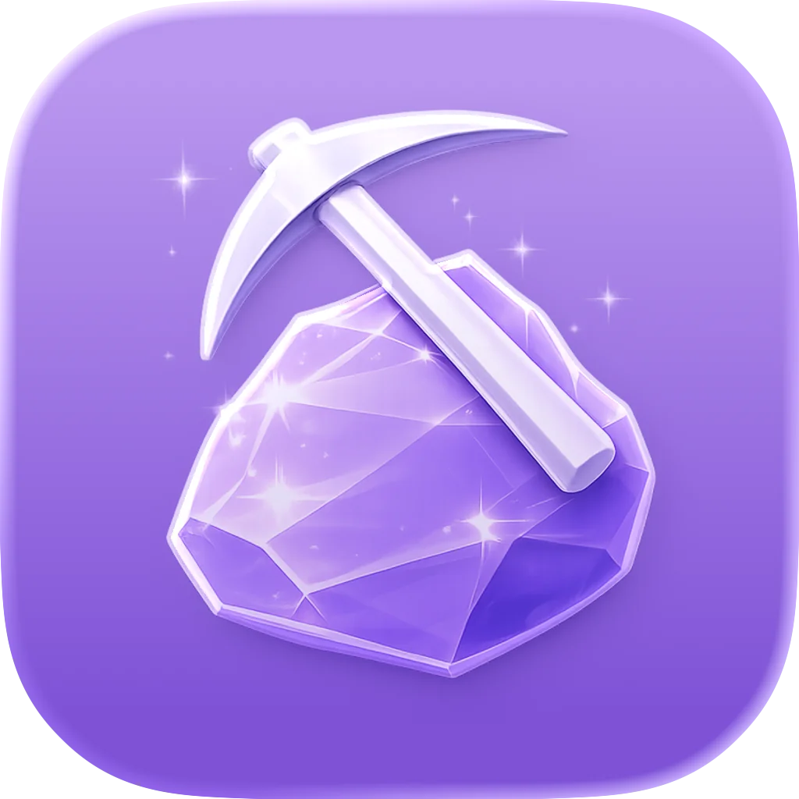
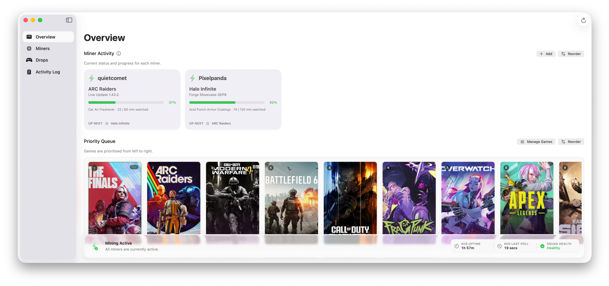
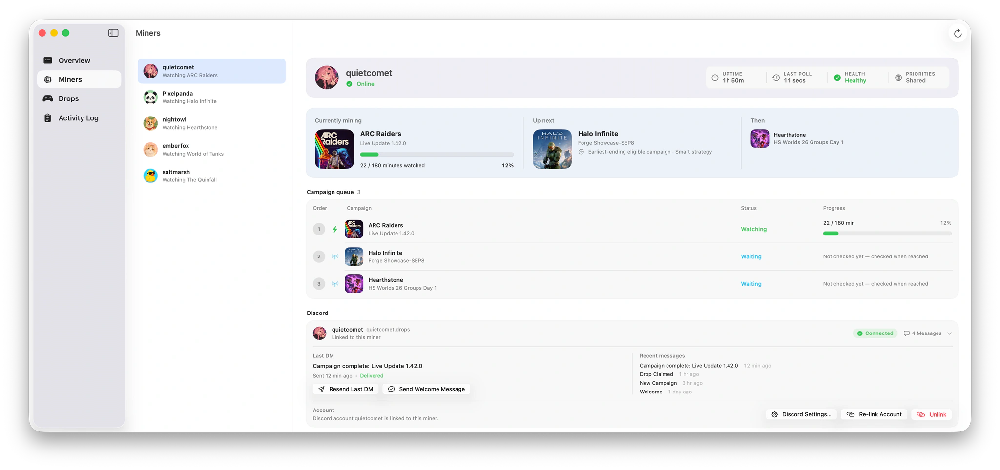
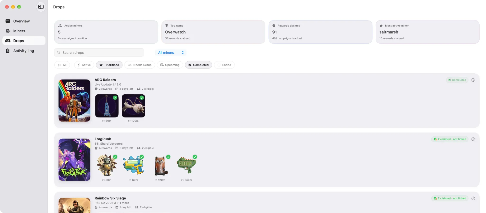
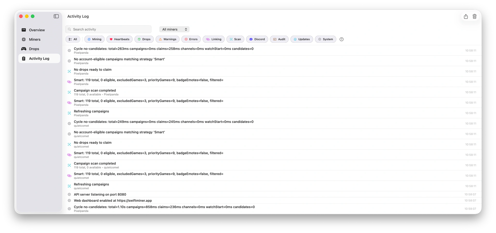

<p align="center">
  <picture>
    <source media="(prefers-color-scheme: dark)" srcset="Website/public/assets/landing/app-icon-light.webp">
    <source media="(prefers-color-scheme: light)" srcset="Website/public/assets/landing/app-icon-light.webp">
    
  </picture>
</p>

<h1 align="center">SwiftMiner — Twitch Drops Miner and Claimer for macOS</h1>

<p align="center">
  A Mac app for mining and claiming Twitch Drops. Secure, lightweight, and multi-account ready.
</p>

<p align="center">
  Wildly over-engineered for collecting pixels, so you can leave it running and think about literally anything else.
</p>

<p align="center">
  <strong><a href="https://swiftminer.app">Twitch Drops Miner for Mac</a></strong>
</p>

<p align="center">
  
  
  
  
  
</p>

## Highlights

- Web UI for remote monitoring and management
- Discord DM support via SwiftBot
- Notarized by Apple for trusted macOS installs
- Built-in update management with Sparkle

**SwiftMiner** is a high-performance, native **Twitch Drops miner and claimer for macOS** designed to automate Drops farming across multiple accounts simultaneously. Built with Swift 6 and SwiftUI, it provides a lightweight, background-ready solution for progress tracking, eligible stream selection, and automatic reward claiming without the need for browser automation or heavy external dependencies.

It is written in Swift using SwiftUI and standard macOS frameworks. Each account runs in its own isolated miner, and the app provides a single interface to monitor progress, claim state, and activity.

It can be used for a single account or multiple accounts.

## Acknowledgements
Special thanks to [DevilXD](https://github.com/DevilXD) for creating [TwitchDropsMiner](https://github.com/DevilXD/TwitchDropsMiner), which provided the initial inspiration for SwiftMiner.

Special thanks to [Max Hewett](https://github.com/maxhewett) for creating [ShipHook](https://github.com/maxhewett/ShipHook) and for his help throughout the project. ShipHook powers SwiftMiner's build, signing, notarization, update, and release pipeline.

## Overview

SwiftMiner monitors active Twitch Drop campaigns and selects streams to watch based on:

- Campaign priority
- Time remaining
- Account eligibility

Each account progresses independently. The app handles stream selection, progress tracking, and claiming completed Drops.

## Why This Exists

SwiftMiner started as a side project to solve a problem I had on macOS.

To mine drops for myself and a few friends, I was running multiple instances of a Twitch drops miner inside a Windows virtual machine. It worked well, but managing several accounts across multiple miner instances wasn’t particularly convenient. Updates needed to be applied to each miner individually, and if something stopped running, it could go unnoticed for a while.

Another goal of the project was to take advantage of modern Swift and macOS technologies. Coordinating multiple miners, account sessions, updates, and network requests provided a real-world use case for features such as Swift Concurrency and helped shape much of SwiftMiner’s architecture.

I wanted a solution that ran natively on macOS and made it easier to manage multiple accounts from a single application. I also wanted updates, account management, and miner monitoring to be handled in one place rather than across several separate windows and processes.

SwiftMiner has been built around those ideas. The goal isn’t to reinvent Twitch drop mining—it’s to make it easier to run and manage on macOS while taking advantage of the platform it runs on. 

## What SwiftMiner Does

- Watches Twitch streams to farm Drops automatically
- Prioritizes campaigns based on time remaining and configured order
- Runs each account as an independent miner
- Tracks in-progress, claimable, and completed Drops in one view
- Automatically claims Drops when they complete
- Supports multiple accounts running in parallel
- Provides both a main window and a menu bar interface
- Uses Twitch device-code login, with no embedded browser
- Ships signed and notarized release builds for macOS
- Supports Sparkle update checks, automatic updates, and unattended updates
- Runs as a native macOS app built with Swift and SwiftUI

## Preview

### Overview

<p align="center">
  <picture>
    <source media="(prefers-color-scheme: dark)" srcset="Website/public/assets/landing/overview-dark.webp">
    <source media="(prefers-color-scheme: light)" srcset="Website/public/assets/landing/overview-light.webp">
    
  </picture>
</p>

### Miners

<p align="center">
  <picture>
    <source media="(prefers-color-scheme: dark)" srcset="Website/public/assets/landing/miners-dark.webp">
    <source media="(prefers-color-scheme: light)" srcset="Website/public/assets/landing/miners-light.webp">
    
  </picture>
</p>

### Drops

<p align="center">
  <picture>
    <source media="(prefers-color-scheme: dark)" srcset="Website/public/assets/landing/drops-dark.webp">
    <source media="(prefers-color-scheme: light)" srcset="Website/public/assets/landing/drops-light.webp">
    
  </picture>
</p>

### Activity Log

<p align="center">
  <picture>
    <source media="(prefers-color-scheme: dark)" srcset="Website/public/assets/landing/activity-log-dark.webp">
    <source media="(prefers-color-scheme: light)" srcset="Website/public/assets/landing/activity-log-light.webp">
    
  </picture>
</p>


## How It Works

- Each account runs its own miner engine
- The engine fetches active campaigns and eligibility from Twitch
- Campaigns are prioritized based on time remaining and user preference
- A stream is selected for the active campaign
- Watch progress is tracked via Twitch APIs
- Completed Drops are claimed automatically

The app sits on top of these engines and presents their state in a single interface.

## Install

Download the latest release from the official [Twitch Drops Miner for Mac website](https://swiftminer.app) or from [GitHub Releases](https://github.com/johnwatso/SwiftMiner/releases).

1. Download the latest `.zip`
2. Move `SwiftMiner.app` to `/Applications`
3. Open the app and add an account
4. Allow notifications if you want claim alerts

> [!TIP]
> **Security Prompt:** On first update or when enabling automatic updates, macOS may prompt for **"App Management"** permissions. This is expected and required for **Sparkle** to perform unattended/auto updates. You should allow this if you want the app to stay up-to-date automatically in the background.

Release builds support both Apple Silicon (`arm64`) and Intel (`x86_64`).

Release builds are signed and notarized through ShipHook, and SwiftMiner includes Sparkle support for update prompts, automatic background checks, and unattended updates when macOS allows them.

> [!NOTE]
> Intel is fully supported in current versions. However, since Apple is dropping Intel support starting in macOS 27, SwiftMiner may also drop Intel support in a future release.

## Releases vs. Development Builds

The latest GitHub release is the most stable version.

Building from the current `main` branch includes newer changes that have not been released yet. These builds may contain bugs, incomplete features, or breaking changes.

> [!NOTE]
> SwiftMiner is updated frequently — sometimes multiple times a day when Twitch changes behavior or bugs need a quick fix. We try to avoid shipping more than one release per day, but it can happen. Enabling automatic or unattended updates is the easiest way to stay current.

## Requirements

- macOS 26+
- Internet access

## Project Layout

```text
Sources/
  SwiftMiner/          macOS app, SwiftUI views, settings, and app resources
  SwiftMinerCore/      mining engine, Twitch services, models, and persistence
  SwiftMinerService/   Discord integration and embedded web-dashboard server
Tests/                 Xcode unit and integration tests
Tools/
  SparklePublisher/    release packaging and Sparkle publishing tool
Website/
  public/              production website, help pages, release notes, appcasts
  styles/              website stylesheet source
Documentation/         architecture, research, testing, and release notes
SwiftMiner.icon/       source assets for the macOS application icon
SwiftMiner.xcodeproj/  generated Xcode project
project.yml            XcodeGen source configuration
scripts/               build, validation, and release automation
```

## Architecture

SwiftMiner is a native Xcode project split between the macOS app and `SwiftMinerCore`, which contains the mining engine, Twitch services, models, and account state.

## Notes and Risk

> [!CAUTION]
> This tool automates Twitch Drop viewing.
>
> Twitch's policies around automation are not always clearly defined, so there is some risk when using it.
>
> Proceed with caution and use at your own discretion.

<!-- markdownlint-disable-next-line MD028 -->
> [!WARNING]
> If the same account is used to watch a stream elsewhere (e.g. in a browser or another device),
> Twitch may prioritise that session instead.
> 
> This can stall drop progress or cause the miner to switch streams.

<!-- markdownlint-disable-next-line MD028 -->
> [!WARNING]
> Twitch may change how Drops or third-party automation is handled at any time. Accounts could be affected. Use with that in mind.

<!-- markdownlint-disable-next-line MD028 -->
> [!NOTE]
> Only one active stream per account contributes to drop progress.

<!-- markdownlint-disable-next-line MD028 -->
> [!NOTE]
> SwiftMiner is intended for personal use on your own machines.

<!-- markdownlint-disable-next-line MD028 -->
> [!NOTE]
> Performance depends on system resources, network conditions, and the number of accounts being managed.

## Issues

Please raise a GitHub issue if something breaks, behaves unexpectedly, or needs attention.

SwiftMiner depends on Twitch's private behavior for Drops, watch progress, and claiming. Changes on Twitch's side can break the app without warning. To reduce downtime, enable automatic updates or unattended updates where possible so fixes are installed as soon as they are released.

## Related Docs

- [Architecture Overview](Documentation/ARCHITECTURE.md)
- [Engine Architecture](Documentation/EngineArchitecture.md)

## License

MIT
